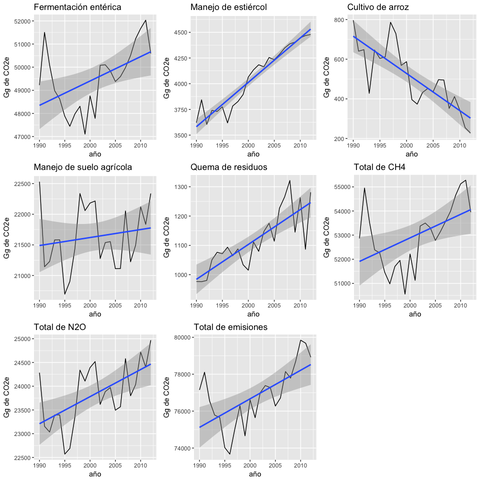
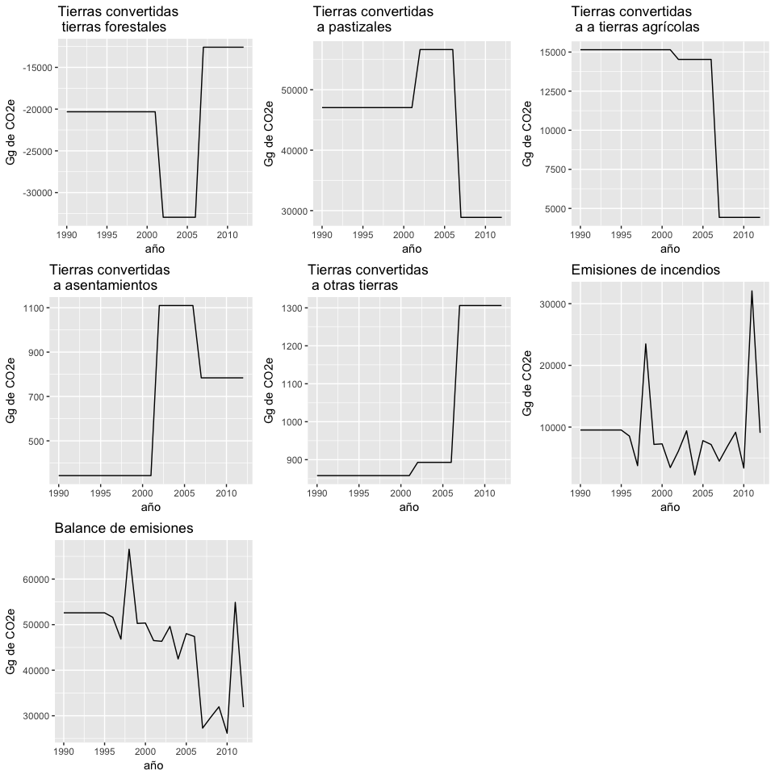

Visualización de las emisiones del sector de agrícola y USCUSS
================
Dante Ruiz
1 de febrero de 2018

Emisiones del sector agrícola, 1990-2012
----------------------------------------

Fuente: Gobierno de la República Instituto Nacional de Ecología y Cambio Climático (INECC) y Secretaría de Medio Ambiente y de Recursos Naturales (SEMARNAT). 2015. "Primer Informe Bieneal de Actualización ante la Convención Marco de las Naciones Unidas sobre el Cambio Climático". INECC/SEMARNAT, México Cuadro III.20, pp 129

Emisiones del sector USCUSS, 1990-2012
--------------------------------------

Fuente: Gobierno de la República Instituto Nacional de Ecología y Cambio Climático (INECC) y Secretaría de Medio Ambiente y de Recursos Naturales (SEMARNAT). 2015. "Primer Informe Bieneal de Actualización ante la Convención Marco de las Naciones Unidas sobre el Cambio Climático". INECC/SEMARNAT, México Cuadro III.26, pp 138
